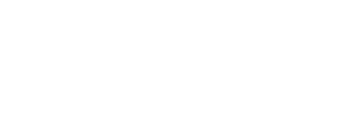

<p align="center">
  <a href="https://studio.asls.io/" target="blank"></a>
  <p align="center">Open source, web-based, show control software and visualizer </p>
</p>

<p align="center">
  <a href="https://madewithvuejs.com/p/asls-studio/shield-link" target="_blank">
    
  </a>
  <a href="https://github.com/ASLS-org/studio/?tab=GPL-3.0-1-ov-file" target="_blank">
    
  </a>
  </a>
  <a href="https://github.com/ASLS-org/studio/releases" target="_blank">
    
  </a>
</p>

## Overview

ASLS Studio is currently in beta version and available for download through its GitHub repository. This guide will help you set up ASLS Studio on your machine.

> **Warning**: ASLS Studio is in early beta phase. Features are provided as-is, without guarantees. Please report any issues on the project's repository.

Full software documentation is available at [studio.asls.io](http://studio.asls.io).

## System Requirements

### Hardware
- RAM: 4GB minimum (8GB or more recommended)
- Graphics: Integrated graphics with WebGL 1.0 / WebGL 2.0 support (Dedicated GPU recommended)

### Software
- Operating System: Any OS supporting the required software
- Node.js: v16.15.1 or higher
- Browser: Latest version of Chrome, Firefox, or Opera

## Installation Process

1. **Clone the Repository**

   Open a terminal and navigate to your desired installation directory. Then run:

   ```
   git clone https://github.com/ASLS-org/studio
   ```

2. **Navigate to Project Directory**

   ```
   cd studio
   ```

3. **Install Dependencies**

   ```
   npm install
   ```

## Running ASLS Studio

### Local Development Server

To start ASLS Studio on a local development server:

1. Run the following command:

   ```
   npm start
   ```

2. Open your browser and navigate to [http://localhost:5173](http://localhost:5173)

### Production Build

To create a production build:

1. Run the build command:

   ```
   npm run build
   ```

2. Locate the built files in the `./dist` folder at the project root.

## Troubleshooting

If you encounter any issues during installation or usage, please report them on the [ASLS Studio GitHub repository](https://github.com/ASLS-org/studio/issues).
